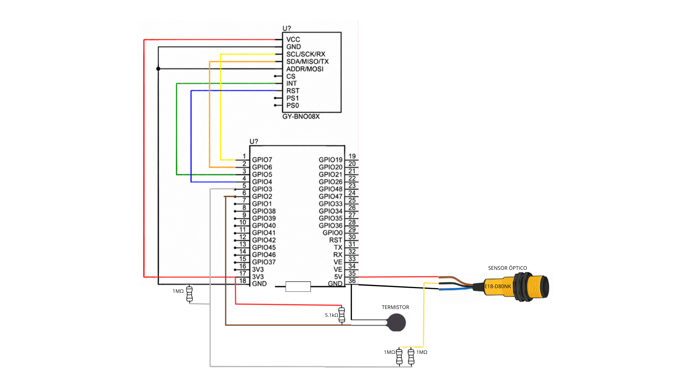

# Sistema de Telemetria Não Invasiva com Edge AI para Monitoramento de Máquinas Legadas

### Projeto de TCC — Programa Nacional de Aprendizado Acelerado em Tecnologia (PNAAT) 2026

> Sistema embarcado para monitoramento não invasivo de máquinas industriais, utilizando sensores e Edge AI para identificar condições de operação e coletar dados de vibração, rotação e temperatura, disponibilizando as informações para acompanhamento e análise.

## Modelo e treinamento Edge Impulse

O modelo de Machine Learning embarcado foi exportado do projeto Edge Impulse e este firmware foi preparado utilizar dados de aceleração (vibração) com exatamente três eixos:
`accel_x,accel_y,accel_z`.

- 100 Hz;
- intervalo de 10 ms entre cada leitura;
- 100 amostras por janela de dados (1s);
- 3 eixos por amostra (accel_x,accel_y,accel_z);
- 300 floats capturados por amostra.


O modelo está contido em:
- `components/edge-impulse-sdk/`
- `components/model-parameters/`
- `components/tflite-model/`

## Fluxo

Pacote integrado com firmware ESP32-S3/BNO085 + Edge Impulse, backend FastAPI e dashboard Next.js.

```text
Máquina N → BNO085 + E18-D80NK + NTC → ESP32-S3/Edge Impulse → Serial → FastAPI → CSV individual + SQLite → Dashboard
```

## Executar o modelo e produzir saídas no terminal:

```bash
idf.py set-target esp32s3
idf.py fullclean
idf.py build
idf.py -p PORT flash monitor
```

# Inicializar dependências 
# para inicalização rápida do dashboard rode start-all.bat duas vezes (uma para dependências e outra para inialização)
# 1. Backend

```powershell
cd backend
py -3.12 -m venv .venv
.\.venv\Scripts\Activate.ps1
python -m pip install -r requirements.txt
python -m uvicorn app.main:app --reload --port 8000
```

Teste:

```text
http://localhost:8000/api/health
http://localhost:8000/docs
```

# 2. Dashboard

Em outro terminal:

```powershell
cd dashboard
npm install
npm run dev
```

Abra:

```text
http://localhost:3000
```


# Sensores (Vibração, RPM, Temperatura) 

- BNO085: Leitura da aceleração e envio para o modelo embarcado, que por sua vez produz as inferências e realiza a classificação.
- E18-D80NK: Sensor óptico verifica a rotação do disco usando interrupção por borda de descida (GPIO3).
- Disco de RPM: 4 furos simétricos = 4 pulsos por volta contabilizam uma volta.
- NTC 10K MF52: Termistor verifica a temperatura próxima ao motor (GPIO2 / ADC1_CHANNEL_1).
- Divisor NTC: resistor fixo de 5,1 kOhm para 3V3.
- Beta usado no teste com o termistor: 3950.


## Cálculo de RPM

`RPM = frequência_de_pulsos * 60 / 4`

A janela é de aproximadamente 1 segundo e o cálculo usa o tempo real em microssegundos.
Foi preservado o filtro:
RPM_filtrado = 0,70 * anterior + 0,30 * atual

### Saída do terminal para cada inferência:
- Probabilidades das classes;
- Classe vencedora e confiança;
- RPM bruto e filtrado;
- Pulsos e frequência do E18;
- Temperatura do NTC;
- Timing do Edge Impulse.


# Pinagem



## Integração do modelo

Cada máquina física utiliza seu próprio ESP32-S3/BNO085 e sua própria porta serial. O firmware envia:

```text
@M → metadados do modelo
@S → accel_x, accel_y, accel_z
@I → classe, confiança e versão do modelo
```

O backend cria um `SerialIngest` independente por máquina cadastrada. A inferência recebida é vinculada ao `machine_id`, persistida no SQLite/PostgreSQL, publicada por SSE e salva no CSV individual da máquina.

## Protocolo serial

O firmware mantem logs legiveis para humanos e tambem emite linhas reservadas para o backend:

```text
@M,<projeto>,<deploy_version>,<samples>,<eixos>,<interval_ms>
@S,<timestamp_us>,<accel_x>,<accel_y>,<accel_z>
@I,<timestamp_us>,<classe>,<confianca>,<deploy_version>
```
O backend ignora as demais linhas de log.


# Métricas

A coleta serial continua em tempo real. Por padrão, uma amostra consolidada é salva no CSV da máquina a cada 10 segundos;

## OEE

```text
OEE = Disponibilidade × Performance × Qualidade

Disponibilidade = tempo OPERANDO / tempo monitorado
Performance     = (tempo de ciclo ideal × produção total) / tempo OPERANDO
Qualidade       = peças boas / produção total
```

O OEE fica indisponível até que a máquina possua tempo de ciclo ideal e contadores de produção válidos.

## MTBF

```text
MTBF = tempo total OPERANDO / número de falhas críticas
```

Uma nova falha é contada na transição para `FALHA`. Se ainda não houve falha, o dashboard exibe `Sem falhas`.


## Funcionalidades adicionais

- cadastro dinâmico de múltiplas máquinas pelo botão `+` no dashboard;
- uma aba por máquina registrada;
- criação automática de `data/maquina_NN.csv` para cada nova máquina;
-O cadastro e os dados de produção ficam persistidos no banco do backend.
- visão geral com OEE geral, MTBF geral, máquinas operando e alertas ativos;
- OEE por máquina com Disponibilidade, Performance e Qualidade;
- MTBF por máquina com base no tempo em operação e falhas críticas;
- histórico disponível dentro da página de cada máquina;

- **RPM pelo E18-D80NK e temperatura pelo NTC 10K MF52 exibidos por máquina no dashboard.**


# Múltiplas máquinas e portas seriais

A primeira máquina é criada automaticamente usando `SERIAL_PORT` e `SERIAL_BAUD` de `industrial-monitor/backend/.env`.

Novas máquinas são cadastradas no dashboard. Para monitoramento simultâneo com hardware real, associe cada máquina a uma porta COM diferente.

Exemplo:

```text
Máquina 01 → COM4 → data/maquina_01.csv
Máquina 02 → COM5 → data/maquina_02.csv
Máquina 03 → COM7 → data/maquina_03.csv
```


# Endpoints principais

```text
GET  /api/overview
GET  /api/machines
POST /api/machines
GET  /api/machines/{id}/state
GET  /api/machines/{id}/history
GET  /api/machines/{id}/metrics
PUT  /api/machines/{id}/production
GET  /api/machines/{id}/serial/status
POST /api/machines/{id}/serial/reconnect
GET  /api/serial/ports
GET  /api/stream
```
